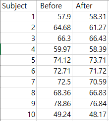

```{r setup, include=FALSE}
knitr::opts_chunk$set(echo = TRUE)
```

## 01 가설 검정하기

### 학습 내용

### 가설 검정의 단계
* (가) 가설 설정
* (나) 유의수준 설정
* (다) 검정방법 설정
* (라) P값 산출
* (마) P값 유의수준보다 큰지 작은지 확인
   * 귀무가설, 대립가설 중 채택

### 분석의 목표
동일한 지원자를 대상으로 다이어트 프로그램 수행 전/후
체중을 기록하여 이들 간의 평균 차이가 통계적으로 유의하게 차이가 존재하는지(다이어트 프로그램이 의미가 있는지) 알아보자.

### 01 데이터 확인


```{r}
data <- read.csv("../R_Data/diet.csv", header=T)
attach(data)
names(data)
data
```

### 02 검정 통계량 분포 확인 및 p-value 값 계산

* 우리는 우선 검정통계량을 결정
* 한 집단의 평균차이가 통계적으로 유의하게 차이가 존재하는지 알아봐야 하므로 동일한 집단의 두 평균 비교에 해당된다.
* 두 집단의 차의 평균이 0인지 아닌지를 확인한다.
* 앞서 살펴본 T검정 통계량을 바탕으로 t검정을 수행하여 p-값을 계산한다.

```{r}
library(ggplot2)
```

```{r}
diff <- Before - After
diff
```


### (1) 다이어트 전후 차이에 대한 확인
```{r}
boxplot(diff)
ggplot(data, aes(x=1, y=diff)) + geom_boxplot()
```


### (2) T 통계량 계산하기
* 01. 각각의 차에 대한 평균 구하기
* 02. 표준 편차 구하기
* 03. 검정 통계량 계산하기 
```{r}
mean_diff <- mean(diff)
mean_diff
sd_diff <- sd(diff)
sd_diff
t_stat <- mean_diff/(sd_diff/sqrt(length(diff)))
t_stat
```

### (3) 양측검정
* 양측검정은 기각역이 양쪽 끝으로 나누어져 있음.
```{r}
t.test(Before, After, alternative=c("two.sided"), paired=TRUE, conf.level=0.95)
```

### (4) 단측검정 
* 기각역이 데이터의 상위 혹은하위꼬리 한쪽에만 존재.
```{r}
t.test(Before, After, alternative=c("greater"), paired=TRUE, conf.level=0.95)
```

### 03 귀무가설 채택 및 검정
#### (A) 유의수준과 p-value를 활용하여 채택 여부를 결정한다.
#### (B) 양측검정, 단측검정 모두 p-value값이 유의수준보다 작다. 
#### (C) 유의수준 5% 기준으로 귀무가설을 기각하고 대립가설을 채택한다.
#### (D) 가설검정을 통해 다이어트 프로그램이 체중 감소 효과가 있음을 알 수 있음.
