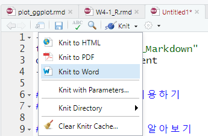

### 03 R마크다운 이용하기
### 학습 내용

### 3-1 R 마크다운 알아보기
* R마크다운을 활용한 데이터 분석 과정의 보고서 작성 가능
* (1) 메뉴이 File 선택
* (2) New-File -> R Markdown 선택


```{r pressure, echo=FALSE}
plot(pressure)
```

### 3-2 그래프 그려보기 
```{r mtcars, echo=FALSE}
library(ggplot2)
qplot(mtcars$cyl)
```

### 3-3 PDF 파일 저장하기
* (1) TeX 소프트웨어 설치하기
  * 원도우 - MiKTeX 설치
  * 맥 - MacTeX(설치)-사파리 접속
* (2) R스튜디오 재실행 후, 마크다운 창에서 [Knit to PDF]선택
* (3) Package Installation 창이 나타나면 설치 실행


### 3-4 기본 문법
#### 특수문자
* 문자 앞뒤에 \* 넣으면 *기울임체* 
* 문자 앞뒤에 \*\* 을 넣으면 **강조체**
* 문자 앞뒤에 ~~ 을 넣으면 ~~취소선~~

#### 링크 만들기
[mygithub](https://github.com/LDJWJ)

* \'을 이용하면 배경색 넣기 `head()`을 이용하여 데이터 일부 출력하기

#### 제목 크기 조정
# 1단계 제목
## 2단계 
### 3단계
#### 4단계

#### `CTRL` + `ALT` + `I`를 누르면 청크 코드 삽입
```{r}

```

### REF
* R마크다운 도움말
 * Help -> Cheatsheets -> R Markdown Cheat Sheet
 * Help -> Cheatsheets -> R Markdown Reference Guide
* R마크다운 공식 사이트 : http://rmarkdown.rstudio.com


